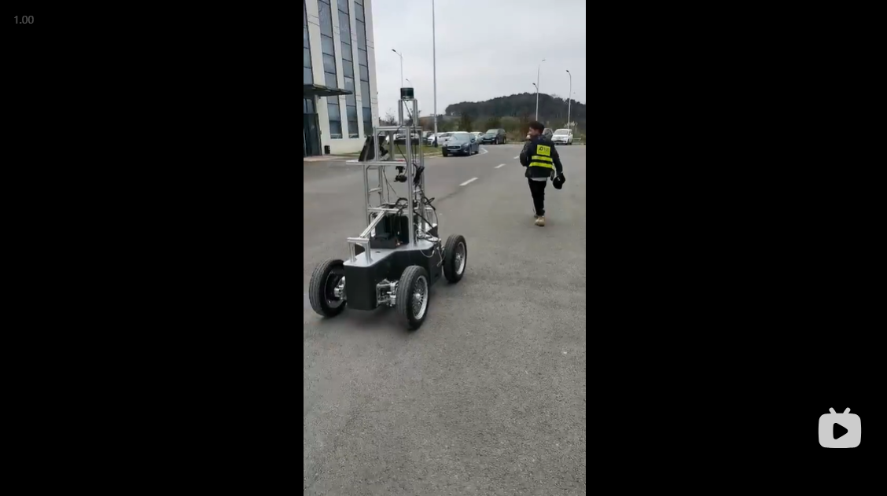

# Follow-Me
This "Follow Me" project implements a tracking visual & control system with using a PixKit-1.0 Chassis.

I designed and implemented a pure visual tracking system for a customer. The customer expected that this tracking system finally could tracking three objects(Cars, Pedestrians and UAVs) and follow them once a goal, means SOT(Single Object Tracking). Followings are two video demos.
## Hardware Requirements
1. Pixkit-1.0 Chassis
2. Gimbal Camera(3-Axis Rotation: Roll Pitch Yaw)
3. IPC with a GPU card(RTX2070 or better)

## Software Requirements
1. Pixkit-1.0 ROS Driver
2. Gimbal Camera control ROS Driver
3. Docker

