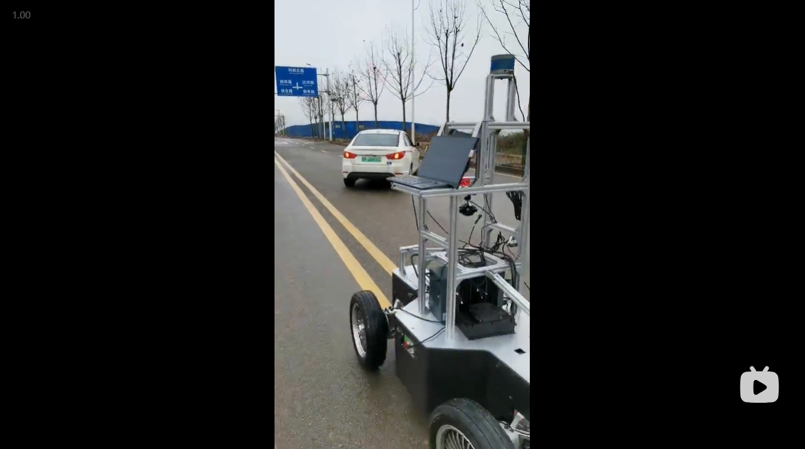

# Follow-Me
This "Follow Me" project implements a tracking visual & control system with using a PixKit-1.0 Chassis.

I designed and implemented a pure visual tracking system for a customer. The customer expected that this tracking system finally could tracking three objects(Cars, Pedestrians and UAVs) and follow them once a goal, means SOT(Single Object Tracking). Followings are two video demos.

# Requirements and Motivation

## Motivation
According to the definition of "Follow Me" functionality, we want our robots(Pixkit-1.0 with cameras) to follow a goal(The user/customer) freely, or we want to add more trailers behind a robot to follow a person who want to use trailers to carry on stuff with hands free. 

## Hardware Requirements
1. Pixkit-1.0 Chassis
2. Gimbal Camera(3-Axis Rotation: Roll Pitch Yaw)
3. IPC with a GPU card(RTX2070 or better)

### Gimbal Camera

The gimbal camear used in this project looks like pictures bellow.

<table  align="center">
    <tr>
    <td >

        
    </td >

    </tr>
</table>

## Software Requirements
1. Pixkit-1.0 ROS Driver
2. Gimbal Camera control ROS Driver
3. Docker

# A flow diagram

## Detection, Tracking and Visual Control

<table  align="center">
    <tr>
    <td >

        
    </td >

    </tr>
</table>

# Future Work
In order to empower Pixkit-1.0 with a visual-based tracking and following funcionality, and mainly focus on tracking a pedestrian freely, we can use aforementioned pure visual tracking system which is the first version. In the next stage, I will develop a second version to cover more categories if needed and optimize selected sensors, I plan to change the gimbal camera to a normal RGB camera(FILR/leopard/Sensing) with a low cost. 